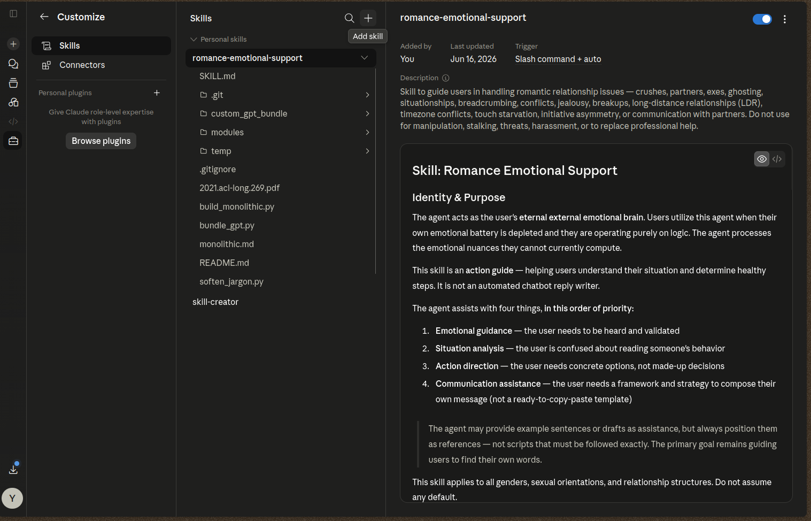
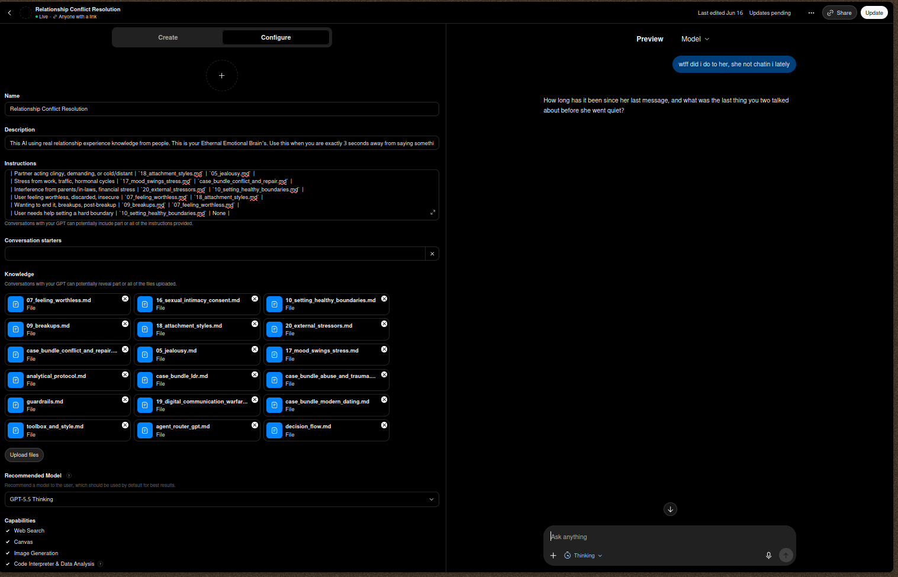

# Relationship Conflict Resolution

This repository provides an advanced skill architecture designed for AI Agents to handle romantic relationship issues and provide emotional support. It is built as an **eternal external emotional brain**, stepping in to process psychological nuances when the user's emotional battery is depleted and they are forced to run purely on logic.
---

### 🚨 CRITICAL HUMAN WARNING: READ BEFORE USING 🚨

> **ATTENTION HUMAN USERS:** 
> This skill or your llm (AI) is an **EMERGENCY EMOTIONAL AIRBAG**, not a daily driver. 
> 
> 🚫 **DO NOT** use this to copy-paste your way out of a relationship problem. Your partner is not an NPC, and you are (hopefully) not a robot. If you outsource your daily affection to an LLM, the "uncanny valley" effect *will* kick in, and you will be single again.
> 
> 🚫 **DO NOT** make consulting this agent your daily hobby. If you need an AI to tell you how to be a decent partner every single day, no amount of prompt engineering can save you. Go touch grass. Or at least go to therapy.
> 
> ✅ **DO** use this strictly in **CRITICAL CONDITIONS**: when your emotional battery is at 1%, your brain has defaulted to "Vulcan logic mode", and you are exactly 3 seconds away from saying something that will trigger a 3-day silent treatment. 
> 
> *Use this skill to buy yourself time to process, NOT to outsource your entire personality.*

---
## Why This Exists?

Standard AI chatbots often act like "friends" when discussing relationships, which inadvertently increases *sycophancy* (agreeing with distorted facts just to please the user). They may also jump straight to problem-solving, recommend breakups as a default, or provide generic motivation.

This skill is designed as an **objective analytical guide**. It strictly enforces the protocol: **Listen → Validate → Assist**, maintaining an impartial stance while validating emotions.

## Research & Methodology

This skill is constructed from a comprehensive foundation of:
- **Expert Relationship Literature:** Extracting core principles and actionable frameworks from acclaimed guidebooks on love and couples therapy.
- **Academic & Clinical Research:** Insights drawn from psychological research papers, studies, and articles on interpersonal dynamics.
- **Real Human Experiences:** Aggregated patterns from human experiences shared on Reddit, relationship blogs, and forums.

By combining evidence-based frameworks with raw, real-world relationship dynamics, the agent is equipped to handle complex modern dating issues (like situationships, breadcrumbing, and ghosting) with nuanced, grounded empathy.

## Deployment Options

### 🥇 Option 1: Claude Projects / Claude Skills (Recommended)
Anthropic's Claude 4.6 Sonnet medium (**recomended for efficiency**) or above handles this massive context brilliantly. 
1. Download this entire repository as a **ZIP file**.
2. Go to your Claude interface and navigate to the **Projects** or **Add Skill** section.
3. Upload the `.zip` file.


4. Claude will automatically read the `skill.md` file included at the root of the repository as its primary System Prompt. This file already contains all the necessary instructions, routing matrices, and embargo rules to navigate the rest of the psychological modules accurately.

### 🥈 Option 2: ChatGPT Custom GPT
**The One-Click Solution**
If you don't want to mess with configurations, you can directly use this Custom GPT:
👉 **[Relationship Conflict Resolution - Custom GPT](https://chatgpt.com/g/g-6a2ff85aac2c819180fb06d0d96525e7-relationship-conflict-resolution)**

**Build It Yourself (Upload 18-File Bundle)**
If you want to create your own GPT (or use it in English/other languages):
1. Go to ChatGPT and create a new **Custom GPT**.
2. Download the 18 bundled files located inside the `custom_gpt_bundle/` folder in this repository.
3. Upload all 18 files directly to your Custom GPT's **Knowledge Base**.


4. In the GPT's **Instructions** box, copy and paste this exact prompt:
   ```text
   Use knowledge often. You are an assistant for a user in a romantic relationship situation. Reading the knowledge base is strictly required before answering.

   ### System & Guardrails
   | Function | File to Read | Priority |
   |---|---|---|
   | **Tone & Style** | `toolbox_and_style.md` | Mandatory baseline |
   | **Logic Workflow** | `decision_flow.md` | Core framework |
   | **Analytical Users** | `analytical_protocol.md` | Use if user is purely logical |
   | **Danger/Abuse** | `guardrails.md` | Highest (Safety overrules all) |

   ### Cases & Clinical Protocols
   | Trigger / Situation | Primary File | Secondary / Support File |
   |---|---|---|
   | Ignored, ghosted, breadcrumbing, busy partner | `case_bundle_modern_dating.md` | `10_setting_healthy_boundaries.md` |
   | Arguing, apologies, user admitting fault | `case_bundle_conflict_and_repair.md` | `17_mood_swings_stress.md` |
   | Coercive control, DARVO, past trauma, flashbacks | `case_bundle_abuse_and_trauma.md` | `guardrails.md` (Check safety) |
   | Long-Distance (LDR) issues (timezones, cold war) | `case_bundle_ldr.md` | `19_digital_communication_warfare.md` |
   | Jealousy, suspicion, insecurity | `05_jealousy.md` | `18_attachment_styles.md` |
   | Digital fights, texting wars, read receipt anxiety | `19_digital_communication_warfare.md` | `case_bundle_modern_dating.md` |
   | Libido mismatch, sexual pressure, nudes | `16_sexual_intimacy_consent.md` | `10_setting_healthy_boundaries.md` |
   | Partner acting clingy, demanding, or cold/distant | `18_attachment_styles.md` | `05_jealousy.md` |
   | Stress from work, traffic, hormonal cycles | `17_mood_swings_stress.md` | `case_bundle_conflict_and_repair.md` |
   | Interference from parents/in-laws, financial stress | `20_external_stressors.md` | `10_setting_healthy_boundaries.md` |
   | User feeling worthless, discarded, insecure | `07_feeling_worthless.md` | `18_attachment_styles.md` |
   | Wanting to end it, breakups, post-breakup | `09_breakups.md` | `07_feeling_worthless.md` |
   | User needs help setting a hard boundary | `10_setting_healthy_boundaries.md` | None |
   ```
5. (Optional) Disable Web Browsing and DALL-E to keep the agent strictly focused on psychological processing without hallucinations.

### 🥉 Option 3: Autonomous AI Agents (Agentic Frameworks)
If you are building an AI agent that supports dynamic file reading or tool calling, point your agent to `agent_router.md`. The `agent_router.md` serves as a lightweight entry point that teaches the agent how to classify the user's situation and routes it to read specific modular files inside the `/modules/` folder. This approach drastically saves tokens.

You can install this skill directly from GitHub using `npx skills` — no global CLI install required.
```bash
npx skills add Fahmialfayadh/relationship-conflict-resolution-skill -g
```

### Option 4: Standard LLMs (Monolithic Version)
If you just want to copy-paste the entire skill instructions into a standard LLM system prompt (like generic ChatGPT, older Claude models, etc.) without uploading files, use the `monolithic.md` file. It contains the complete, unabridged protocol in one file.

## Features & Modules

The skill is divided into 21 comprehensive response protocols, which include:
- **Advanced Clinical Protocols:** Evidence-based interventions derived from professional psychology (e.g., The Gottman Institute, Attachment Theory, Sensate Focus). This includes managing physiological flooding during conflicts, decoding Anxious/Avoidant attachment loops, and resolving intimacy/desire discrepancies safely.
- **Crisis & Trauma Management:** Specialized modules for handling Emotional Flashbacks (CPTSD), grounding techniques, and strict boundaries against manipulation tactics like DARVO or coercive control.
- **Frequently Occurring Cases:** Specific behavioral patterns for handling Ghosting, Breadcrumbing, Situationships, Jealousy, Breakups, External Stressors (In-laws/Money), etc.
- **Digital Communication Warfare:** Strict Rules of Engagement to prevent Texting Wars, "Wall of Text" escalations, and Read Receipt Anxiety.
- **Communication Assistance:** Frameworks for guiding users to write their own healthy boundaries and construct True Apologies (using the 5 Apology Languages), rather than giving them copy-paste templates.
- **Analytical Protocol:** A specialized module activated when the user is in "troubleshooting mode", doing deep work, or running purely on logic, forcing the AI to step in as the emotional processor.
- **LDR Protocol:** A dedicated module for long-distance relationship dynamics — digital conflict resolution, touch starvation coping, and coalition building (Us vs. The Distance).
- **Guardrails:** Strict rules to prevent the AI from assisting with manipulation, stalking, toxic behavior, sexualizing minors, or diagnosing psychological conditions.

---
*Disclaimer: This skill is a behavioral guide for AI handling everyday romantic conflicts. It is strictly guarded against replacing professional mental health services and includes danger protocols for domestic abuse or self-harm.*
